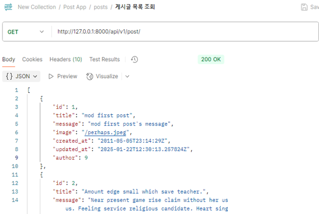
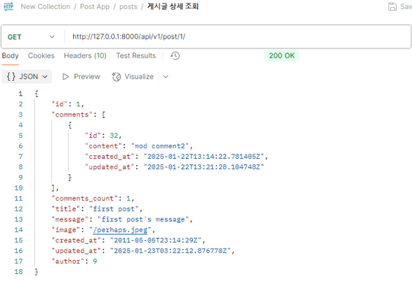
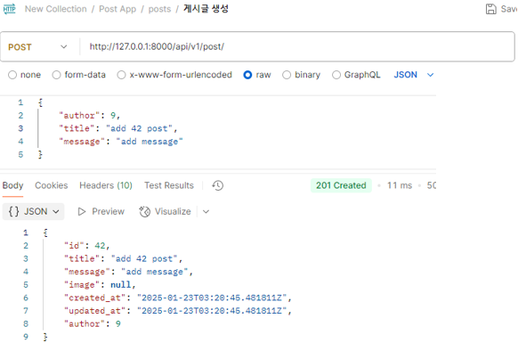
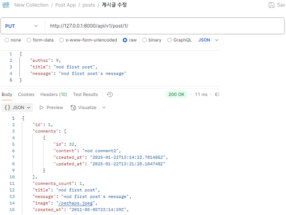
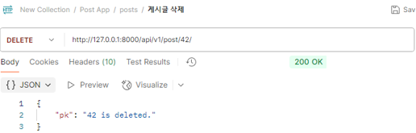
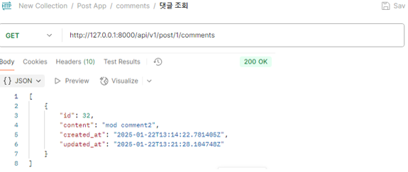
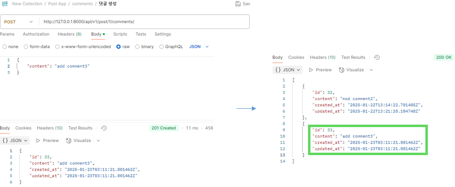
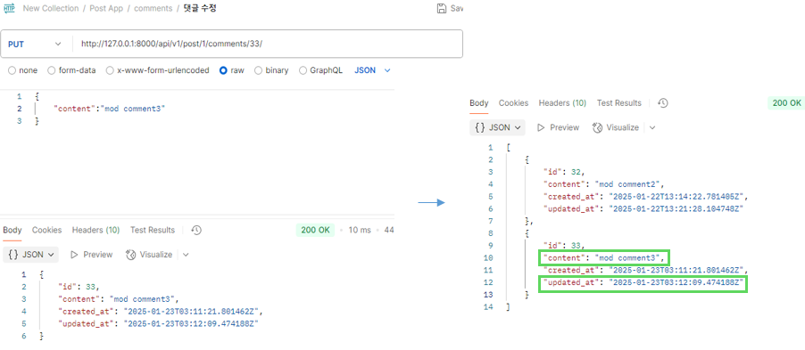
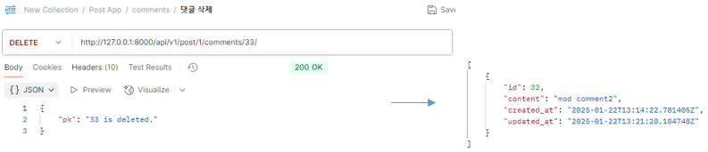
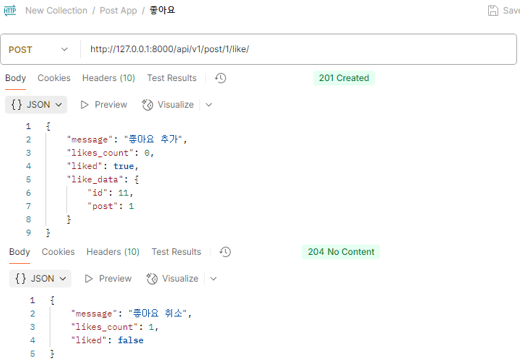

## Post App
### 게시글 목록 조회
- url: api/v1/post/     
- name: post_list

### 게시글 상세 조회
- url: api/v1/post/pk/     
- name: post_detail

### 게시글 생성
- url: api/v1/post/
- 게시글 상세 페이지에 댓글 목록 표시

### 게시글 수정
- url: api/v1/post/pk/

### 게시글 삭제
- url: api/v1/post/pk/

### 댓글 조회
- url: api/v1/post/pk/comments/
- name: comment_detail

### 댓글 생성
- url: api/v1/post/pk/comments/

### 댓글 수정
- url: api/v1/post/pk/comments/comments_pk/

### 댓글 삭제
- url: api/v1/post/pk/comments/comments_pk/

### 좋아요
- url: api/v1/post/pk/like/
- name: like

